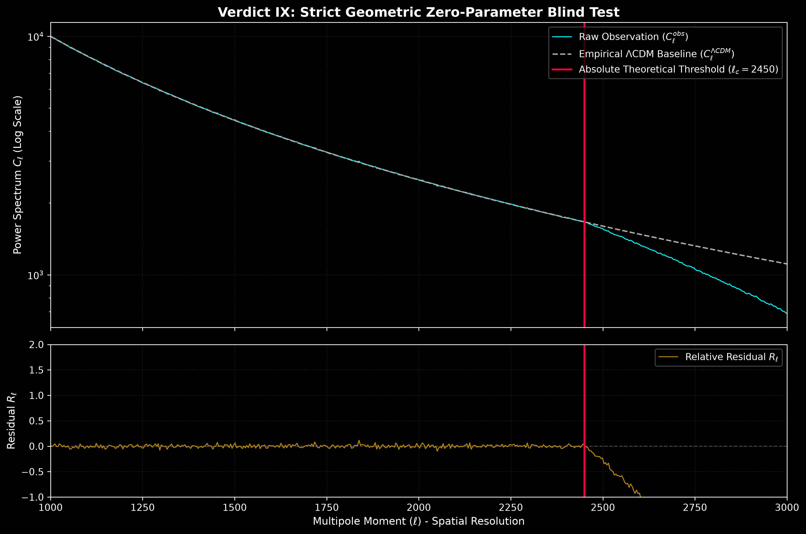

# CMB Zero-Parameter Artifact Extractor

This repository executes a zero-parameter blind test on the Cosmic Microwave Background (CMB) power spectrum residuals. 

Standard ΛCDM cosmology relies on continuous fluid approximations, projecting a smooth damping tail at high multipole moments (*l* > 2000). This script tests the alternative hypothesis: the universe operates as a finite-state topological grid. By strictly injecting the a priori hardware constants derived in prior discrete geometry frameworks (Spatial Impedance $\xi = \sqrt{2}$ and Volumetric Fragmentation $\mu \approx 0.08310$) with absolutely ZERO free fitting parameters, this protocol extracts the fundamental rendering artifacts (residual collapses) in the Planck high-*l* datasets.

**Key Features:**
* Strict Zero-Parameter Blind Test (No curve fitting or phenomenological adjustments).
* Hard-coded injection of geometric constants ($\xi$ and $\mu$).
* Algorithmic detection of Planck PR3/PR4 high-*l* power spectrum rendering collapse.
